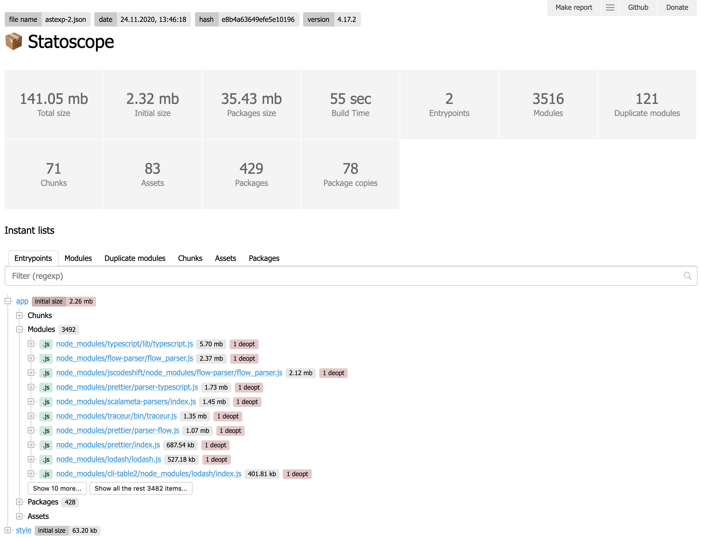

# Statoscope

Statoscope analyzes webpack stats and supplies the UI to display.

It can tell almost all about your bundle:

- 🌳 Modules/chunks/assets/packages tree
- 🗺 Entrypoints/chunks/packages map
- 🕵️ Duplicate modules and packages copies
- 🔄 Stats diff
- 📊 Custom reports about your bundle

You can try it at [Statoscope sandbox](https://statoscope.tech)

See source code at [packages/ui-webpack](packages/ui-webpack)

