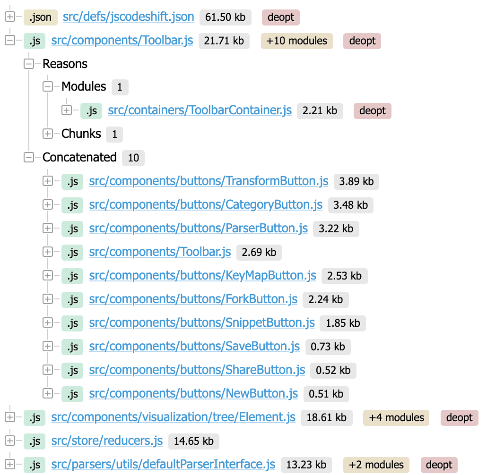
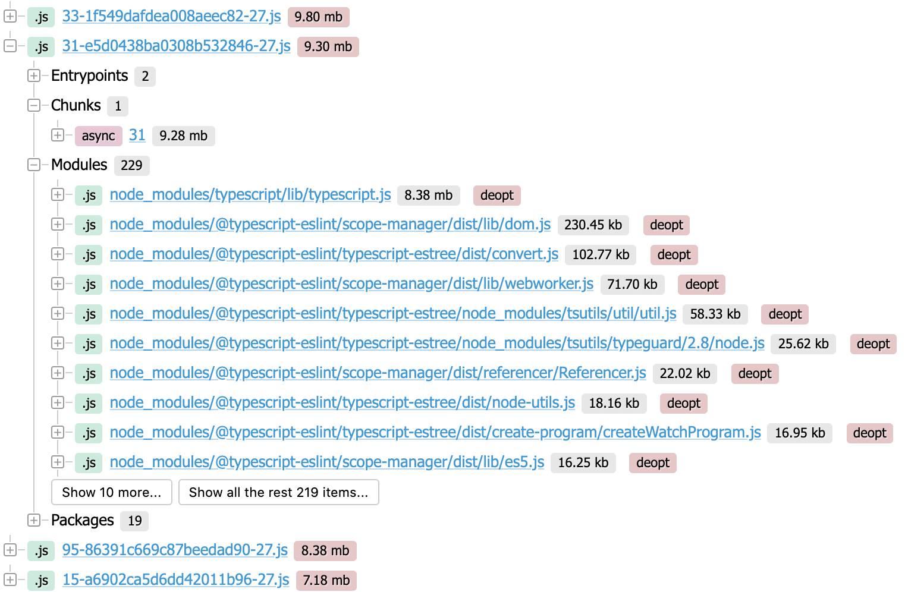

# Statoscope for webpack

[](https://badge.fury.io/js/%40statoscope%2Fui-webpack)
[](https://www.paypal.com/paypalme/smelukov)

Statoscope analyzes webpack stats and shows detailed info about it on the screen.

You can try it at [Statoscope sandbox](https://statoscope.tech)

## Installation

```sh
npm install @statoscope/ui-webpack --save-dev
```

## Usage

```js
import init from '@statoscope/ui-webpack';

init(stats);
```

## Key-features list

### Entry points

Shows entry points with their chunks, modules, assets, and used packages.


### Modules

Shows a tree of the modules with their dependencies and reasons. You can simply find out why a module was bundled.


 
### Chunks

Shows all the chunk in the bundle, split by a type, with a tree of the modules and packages in these chunks.


### Assets

Shows all the chunk in the bundle with a tree of the modules and packages in these chunks.



### Packages

Shows all the packages (node_modules) in the bundle all of their copies and the reasons.


> This is only a short description of Statoscope features. Just try it by yourself and find out more about your bundle.
