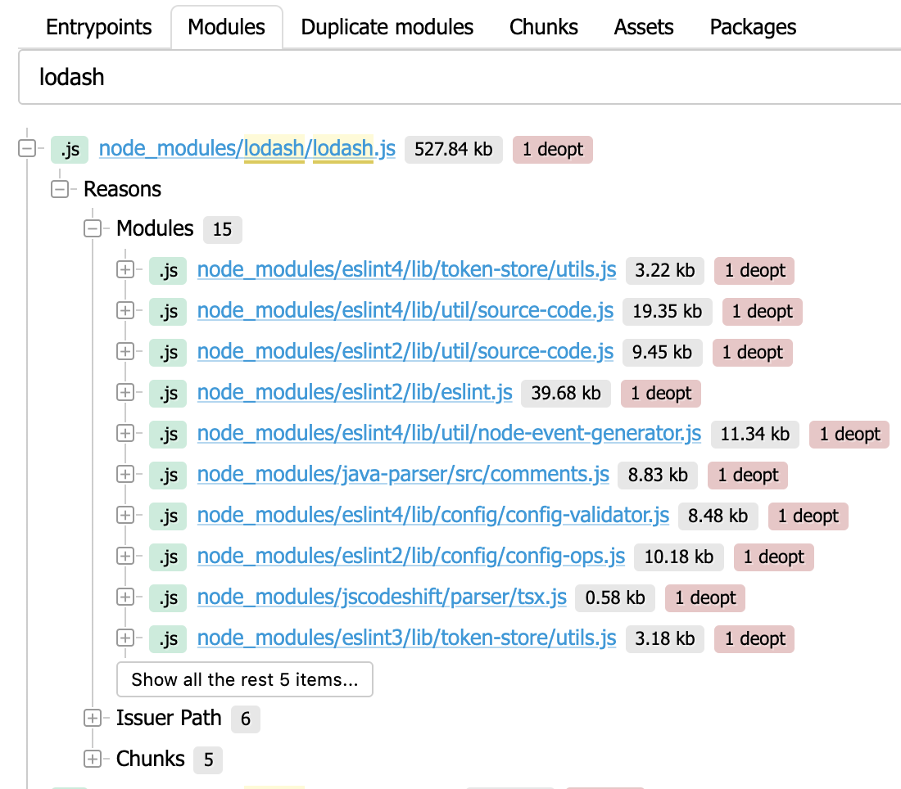
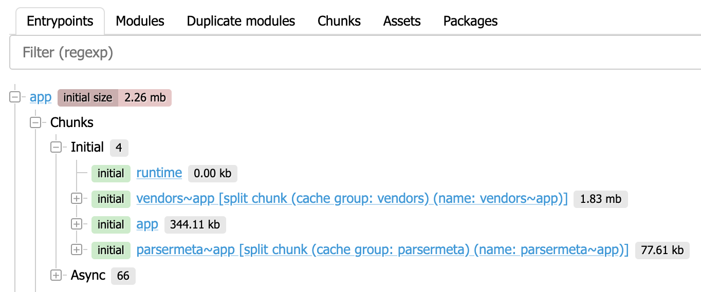
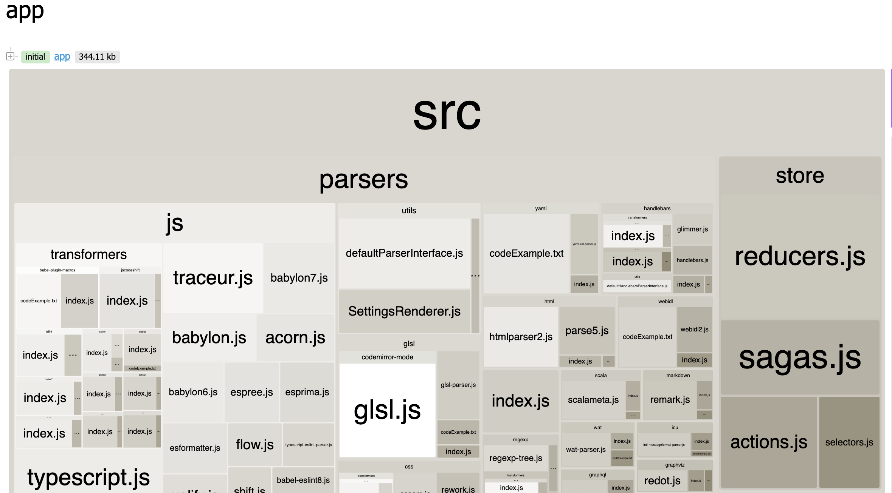
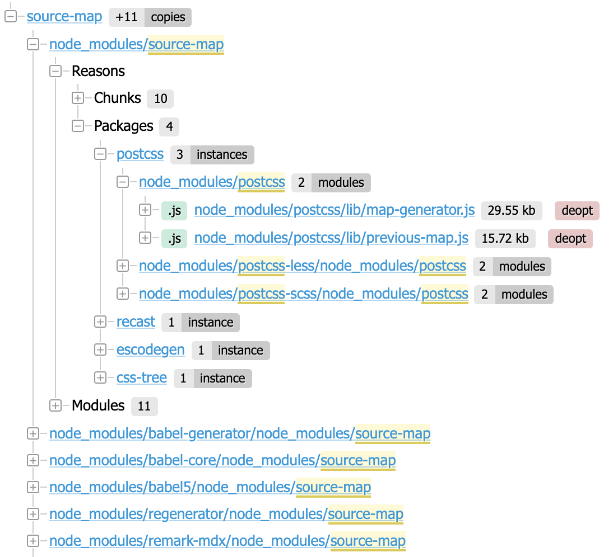
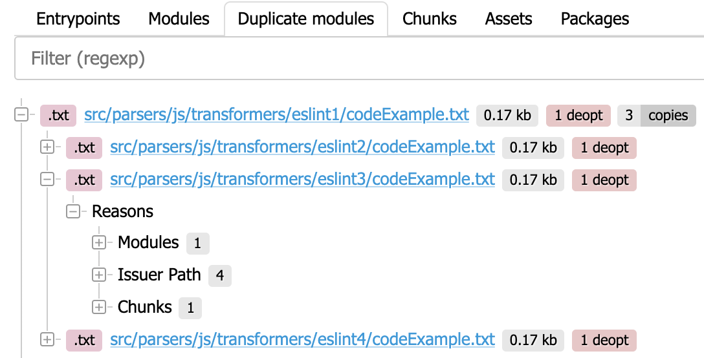
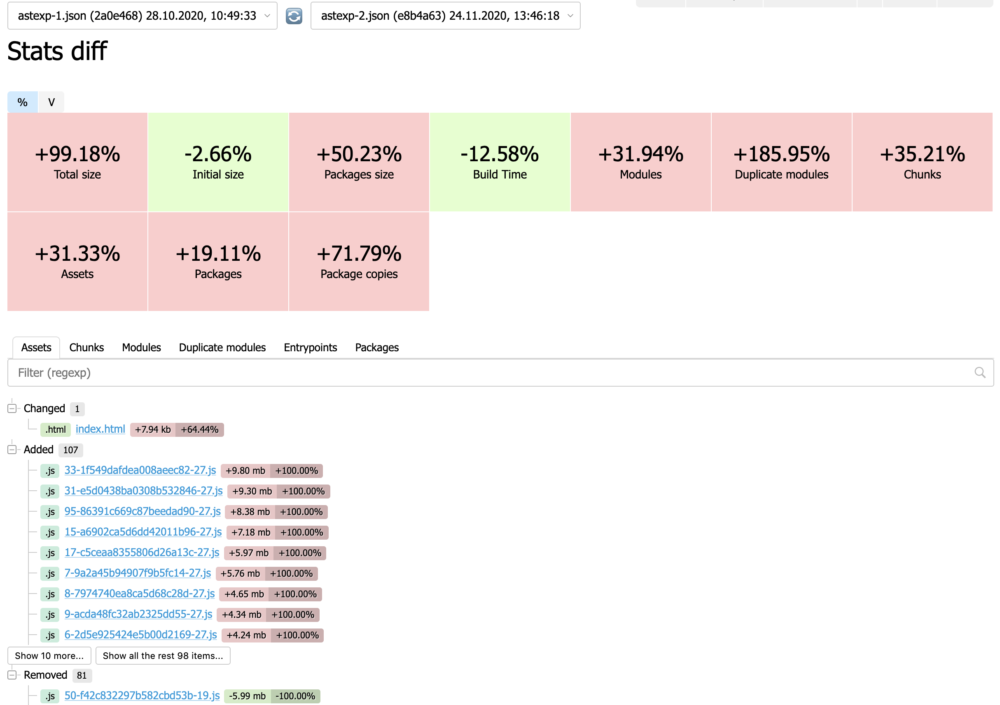

# Statoscope for webpack

[](https://badge.fury.io/js/%40statoscope%2Fui-webpack)
[](https://opencollective.com/statoscope)

Statoscope analyzes webpack stats and supplies the UI to display.

It can tell almost all about your bundle:

- 🌳 Modules/chunks/assets/packages tree
- 🗺 Entrypoints/chunks/packages map
- 🕵️ Duplicate modules and packages copies
- 🔄 Stats diff
- 📊 Custom reports about your bundle
- 🐘 No stats size limitation

You can try it at [Statoscope sandbox](https://statoscope.tech)

## Installation

```sh
npm install @statoscope/ui-webpack --save-dev
```

## Usage

### As webpack plugin

Statoscope webpack plugin saves a report into an HTML file.

**webpack.config.js:**
```js
const StatoscopeWebpackPlugin = require('@statoscope/ui-webpack');

config.plugins.push(new StatoscopeWebpackPlugin());
```

There are some **optional** options.

```js
new StatoscopeWebpackPlugin({
  saveTo: 'path/to/report-[name]-[hash].html',
  saveStatsTo: 'path/to/saving/stats-[name]-[hash].json',
  statsOptions: { /* any webpack stats options */ },
  additionalStats: ['path/to/any/stats.json'],
  watchMode: false,
  name: 'some-name',
  open: 'file'
})
```

#### options.saveTo: string

Path to an HTML with a report.

By default is a temporary directory with filename: `statoscope-[name]-[hash].html`

`[name]` replacing by `options.name` (if specified) or `compilation.name` (if specified) or `unnamed`

`[hash]` replacing by `compilation.hash`


#### options.saveStatsTo: string

A path for saving the stats: `stats-[name]-[hash].json`

`[name]` replacing by `options.name` (if specified) or `compilation.name` (if specified) or `unnamed`

`[hash]` replacing by `compilation.hash`

By default don't save anything

#### options.statsOptions: [StatsOptions](https://webpack.js.org/configuration/stats/#stats-options)

With `statsOptions` you can override your webpack-config `stats` option

For example: `statsOptions: { all: true, source: false }`

If not specified (by default) then `stats` options from your webpack config will be used.

> All stats-options see at [docs](https://webpack.js.org/configuration/stats/#stats-options)

#### options.additionalStats: string[]

List with the paths to webpack stats that will be loaded into Statoscope along with current compilation stats.

In UI, you may switch between them or diff.

```js
const glob = require('glob');

new StatoscopeWebpackPlugin({
  saveStatsTo: 'path/to/stats/stats-[name]-[hash].json',
  additionalStats: glob.sync('path/to/stats/*.json'),
})
```

In this example, the stats from every compilation will be saved into `path/to/stats/` directory.

Also, all JSON files from `path/to/stats/` directory will be added to the Statoscope report.

In this way, you can collect the stats from all compilations and diff these to find out how your bundle was changing in time.

#### options.watchMode: boolean

By default, Statoscode does not generate a report if the webpack runs in watch-mode.

Set `watchMode: true` to generate a report in watch-mode

#### options.name: string

Custom compilation name.

By default `compilation.name` (if specified)

#### options.open: enum

Open report after compilation.

- `false` - don't open report
- `file` - open html with report
- `dir` - open a directory with html file

`dir` by default.

### As standalone UI (only for browser)

**1\.** Collect the bundle stats with:

```sh
webpack --json > stats.json
```

**2\.** Pass stats file to Statoscope

```js
import init from '@statoscope/ui-webpack';
import stats from 'path/to/stats.json'

init({
  name: "stats.json",
  data: stats
});
```

> Also, you may pass an array of stats

### Importing styles

`import init from '@statoscope/ui-webpack'` imports a bundle with built-in scripts and styles.

To import scripts and styles separately, use:

```js
import '@statoscope/ui-webpack/dist/split/main.css';
import init from '@statoscope/ui-webpack/dist/split/main.js';
```

## Use-cases

### Find out why a module was bundled

Every module has an issuer path (the shortest way to a module) and the reasons (other modules and chunks that require a module).

Use modules tree to find all the places where a module was required.



### Find out which chunks will block page loading

A massive bundle should be split into small async chunks. Synchronous (initial) chunks block your page loading and rendering till these chunks load.

Less initial size is better:


Use chunks tree to find out which chunks are synchronous and try to [split it](https://webpack.js.org/guides/code-splitting/).



Also, you can view a chunk map to look at a chunk from the other side:



### Find package copies

Your bundle may use a few versions of the same package (node module).

Use package tree to find out how many package copies was bundled:



### Find module duplications

Sometimes we have a few modules with the same content. Statoscope can find these modules and show when these modules were required.



> This is only a short description of Statoscope features. Just try it by yourself and find out more about your bundle.

### Compare your stats

Statoscope has a powerful tool to compare the stats.



### Create a custom report and share it

Statoscope provides a way to create your own report with [Jora language](https://github.com/discoveryjs/jora) and [Discovery.js](https://github.com/discoveryjs/discovery).

- click `Make report`
- write a jora-request
- describe a UI to view the result
- copy the URL and share it

Example: [Top 5 biggest assets](https://statoscope.tech/#report&dzen&title=Top%205%20biggest%20assets&q=Y29tcGlsYXRpb25zLmFzc2V0cy5zb3J0KHNpemUgZGVzYylbOjVd&v=ewogICAgdmlldzogJ2xpc3QnLAogICAgaXRlbTogewogICAgICB2aWV3OiAnYXNzZXQtaXRlbScsCiAgICAgIGRhdGE6IGB7YXNzZXQ6ICR9YAogICAgfQp9)

## FAQ

### Getting stats from a boilerplate project

If you're using Create React App then use `--stats` argument to get the stats:

`yarn build --stats` or `npm run build -- --stats`

This will create `build/undle-stats.json` that can be used in Statoscope.

### Error while loading a stats

If you have an error with the text `Unexpected token W in JSON at position 0` then you are probably using webpack-bundle-analyzer
that corrupts webpack output. Just remove the first line of your stats file and try to load your file again.

### Which stats-flags Statoscope use?

Statoscope use only stats that it has. There is only one required flag - `hash`.

```
stats: {
  all: false, // disable all the stats
  hash: true, // add a compilation hash
}
```

It works, but useless, because the result stats is empty.

You may disable some stats-flags to decrease your stats-file size.
Here is a set of minimum useful stats flags:

```
stats: {
  all: false, // disable all the stats
  hash: true, // add compilation hash
  entrypoints: true, // add entrypoints stats
  chunks: true, // add chunks stats
  chunkModules: true, // add modules stats
  reasons: true, // add modules reasons stats
},
```

And an example of full stats:

```
stats: {
  all: false, // disable all the stats
  hash: true, // add compilation hash
  entrypoints: true, // add entrypoints stats
  chunks: true, // add chunks stats
  chunkModules: true, // add modules stats
  reasons: true, // add modules reasons stats

  assets: true, // add assets stats
  chunkOrigins: true, // add chunks origins stats (to find out which modules require a chunk)
  version: true, // add webpack version
  builtAt: true, // add build at time
  timings: true, // add build at time
  performance: true, // add info about oversized assets
  source: true, // add module sources (uses to find modules duplicates)
},
```

## Support

If you are an engineer or a company that is interested in Statoscope improvements, you may support Statoscope by financial contribution at [OpenCollective](https://opencollective.com/statoscope).
