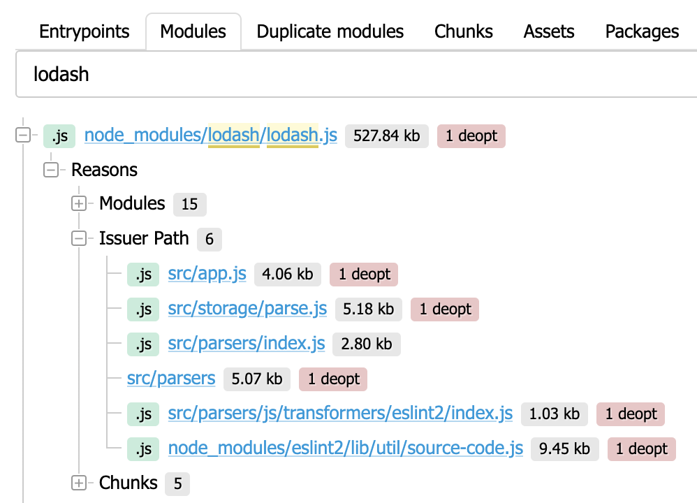
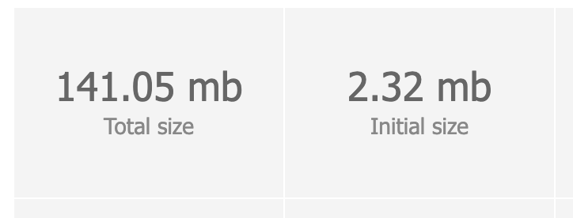
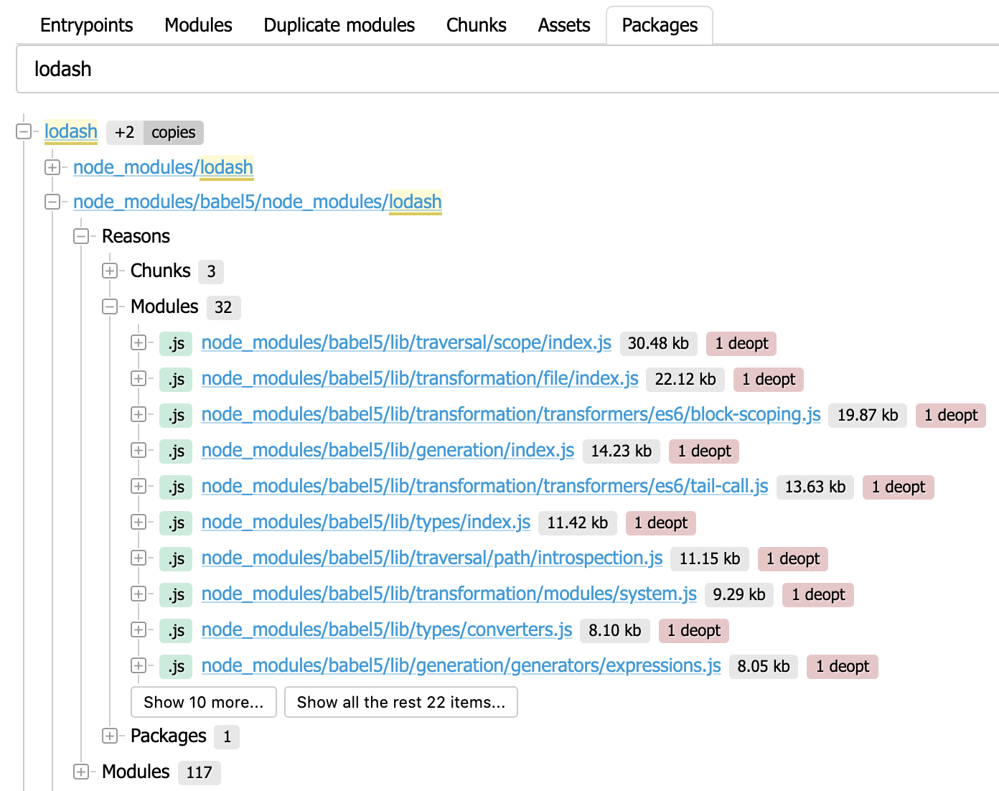

# Statoscope for webpack

[](https://badge.fury.io/js/%40statoscope%2Fwebpack-ui)
[](https://opencollective.com/statoscope)

This package contains a UI for analyzing stats of your bundle.

**Key features:**

- 🌳 Full dependency tree (modules/chunks/assets/entrypoints/packages)
- 🗺 Size map (entrypoints/chunks/packages)
- 🕵️ Packages copies and duplicates of modules detection
- 🔄 Stats comparison
- 📊 Custom reports for your stats (with [jora QL](https://discoveryjs.github.io/jora/))
- 🐘 No stats size limitation
- 🗜 Smart HTML report compression (up to 200x)

You can try it at [Statoscope sandbox](https://statoscope.tech)

## Usage

### As webpack plugin

See [@statoscope/webpack-plugin](https://github.com/statoscope/statoscope/tree/master/packages/webpack-plugin)

### As standalone UI (only for browser)

**1\.** Collect the bundle stats with:

```sh
webpack --json > stats.json
```

**2\.** Pass stats file to Statoscope

```js
import init from '@statoscope/webpack-ui';
import stats from 'path/to/stats.json'

init({
  name: "stats.json",
  data: stats
});
```

> Also, you could pass an array of stats

## Use-cases

### Find out why a module was bundled

Every module has an issuer path (the shortest way to a module) and the reasons (other modules and chunks that require a module).

Use modules tree to find all the places where a module was required.



### Find out which chunks will block page loading

A massive bundle should be split into small async chunks. Synchronous (initial) chunks block your page loading and rendering till these chunks load.

Less initial size is better:



Use chunks tree to find out which chunks are synchronous and try to [split it](https://webpack.js.org/guides/code-splitting/).


Also, you can view a chunk map to look at a chunk from the other side:


### Find package copies

Your bundle could use a few versions of the same package (node module).

Use package tree to find out how many package copies were bundled:



### Find module duplications

Sometimes we have a few modules with the same content. Statoscope can find these modules and show when these modules were required.


> This is only a short description of Statoscope features. Just try it by yourself and find out more about your bundle.

### Compare your stats

Statoscope has a powerful tool to compare the stats.

Just drop two (or more) stats files to https://statoscope.tech and press the `Diff` button.

If you're using the webpack plugin, use [additionalStats](https://github.com/statoscope/statoscope/tree/master/packages/webpack-ui#optionsadditionalstats-string) property.


### Create a custom report and share it

Statoscope provides a way to create your own report with [Jora language](https://github.com/discoveryjs/jora) and [Discovery.js](https://github.com/discoveryjs/discovery).

- click `Make report`
- write a jora-request
- describe a UI to view the result
- copy the URL and share it

Example: [Top 5 biggest assets](https://statoscope.tech/#report&dzen&title=Top%205%20biggest%20assets&q=Y29tcGlsYXRpb25zLmFzc2V0cy5zb3J0KHNpemUgZGVzYylbOjVd&v=ewogICAgdmlldzogJ2xpc3QnLAogICAgaXRlbTogewogICAgICB2aWV3OiAnYXNzZXQtaXRlbScsCiAgICAgIGRhdGE6IGB7YXNzZXQ6ICR9YAogICAgfQp9)

## FAQ

### Getting stats from a boilerplate project

If you're using Create React App then use `--stats` argument to get the stats:

`yarn build --stats` or `npm run build -- --stats`

This will create `build/undle-stats.json` that can be used in Statoscope.

### Error while loading a stats

If you have an error with the text `Unexpected token W in JSON at position 0` then you are probably using webpack-bundle-analyzer
that corrupts webpack output. Just remove the first line of your stats file and try to load your file again.

### Which stats-flags Statoscope use?

Statoscope use only stats that it has. There is only one required flag - `hash`.

```
stats: {
  all: false, // disable all the stats
  hash: true, // add a compilation hash
}
```

It works, but useless, because the result stats is empty.

You could disable some stats-flags to decrease your stats-file size.
Here is a set of minimum useful stats flags:

```
stats: {
  all: false, // disable all the stats
  hash: true, // add compilation hash
  entrypoints: true, // add entrypoints stats
  chunks: true, // add chunks stats
  chunkModules: true, // add modules stats
  reasons: true, // add modules reasons stats
},
```

And an example of full stats:

```
stats: {
  all: false, // disable all the stats
  hash: true, // add compilation hash
  entrypoints: true, // add entrypoints stats
  chunks: true, // add chunks stats
  chunkModules: true, // add modules stats
  reasons: true, // add modules reasons stats

  assets: true, // add assets stats
  chunkOrigins: true, // add chunks origins stats (to find out which modules require a chunk)
  version: true, // add webpack version
  builtAt: true, // add build at time
  timings: true, // add build at time
  performance: true, // add info about oversized assets
  source: true, // add module sources (uses to find modules duplicates)
},
```

### Statoscope shows an absolute path to the modules

Just specify a context to stats options:

```
stats: {
  context: 'path/to/project/root'
}
```

## Support

If you are an engineer or a company that is interested in Statoscope improvements, you could support Statoscope by financial contribution at [OpenCollective](https://opencollective.com/statoscope/contribute) or [GitHub Sponsors](https://github.com/sponsors/statoscope).
